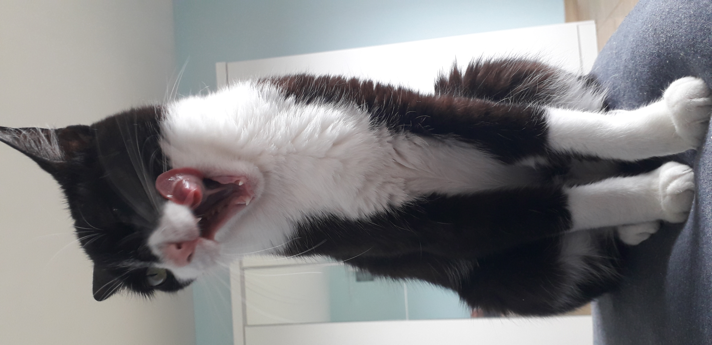
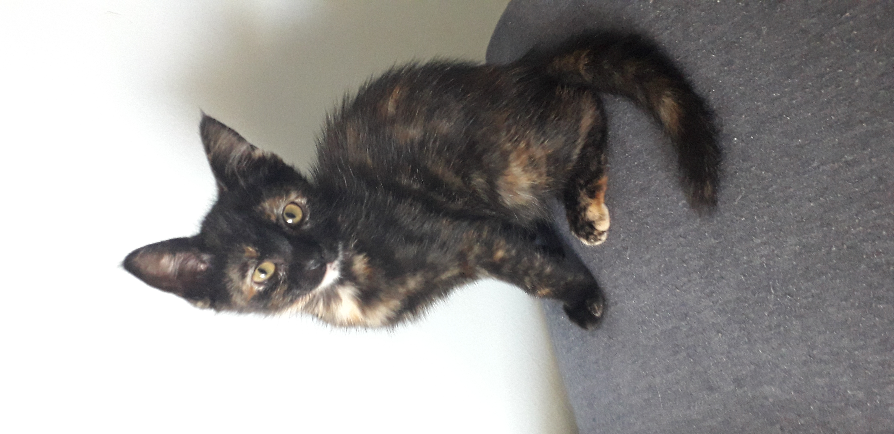

  <ul style="list-style: none;">
    

      <h1>
        ¡Sea bienvenido, mi hermano o hermana de código!
      </h1>
    

  </ul>

<!--
  Cómo se renderiza un h1 y h2 sin subrayado:
  https://gist.github.com/CodeByAidan/bb43bdb1c07c0933d8b67c23515fb912
-->

Mi nombre es Eduardo de Oliveira Rosa, programador brasileño, en los viejos tiempos conocido como
"Mestre Tramador". Estas son mis gatas, Kyoshi e Yangchen, llamadas así en homenaje a las [Avatares del][kyoshi]
[mismo nombre][yangchen].

  
  &nbsp;
  <!-- markdownlint-disable-next-line MD013 -->
  
  &nbsp;
  

---

### Léelo también en: [English][en], [Português][pt]

  <ul style="list-style: none;">
    

      <h2>
        Sobre mí
      </h2>
    

  </ul>

Tengo 26 años y finalmente obtuve mi título universitario de "Jogos Digitais" en el "[Centro Universitário
FADERGS][fadergs]", miembro del Ecosistema Ânima, que puedes consultar [aquí][fadergs-degree].
Actualmente trabajo como desarrollador en la plataforma [Workupy][workupy], un futuro hub no code
para simplificar la creación de software.

Actualmente realicé tres posgrados en "[CENES]" ("Centro de Estudos de Especialização e
Extensão"), uno de los cuales es en "Algoritmos e Estruturas de Dados", otro en "Arquitetura de
Sistemas da Informação", y lo último en "Redes Estruturadas de Computadores".

Investigo constantemente formas de mejorar mis habilidades de codificación y también planeo ideas de
juegos o proyectos, que tal vez intentaré implementar, como digo, todavía estoy tratando de descobrir
mi rumbo.

About other details of myself, I am a defensor of open source and free softwares, so all of my repositories
generally comes with a GNU License, and on my free time I play with photo and video editing, creating
material to the RPG campaigns I play with my friends.

Sobre otros detalles sobre mí, soy un defensor del código abierto y del software libre, por lo que
todos mis repositorios generalmente vienen con Licencia GNU, y en mi tiempo libre juego con la edición
de fotografía y vídeo, creando material para las campañas de RPG que juego con mis amigos.

Si quieres hablar conmigo, revisa mis redes sociales abajo! Como mencionado, ¡hablo portugués, español
e inglés!

¡Ten siempre fe en tu código, y gracias por pasar!

  
  &nbsp;
  
  &nbsp;
  

---

  <ul style="list-style: none;">
    

      <h2>
        Sobre mi experiencia
      </h2>
    

  </ul>

Si quieres saber sobre mi experiencia, la he separado en temas para que puedas leerla abajo sin problemas
según lo que te interesa.

  

    Stacks y habilidades...
  

  <blockquote>
    <!-- markdownlint-disable-next-line MD013 -->
    <abbr title="If you want to accomplish something in the world, idealism is not enough — you need to choose a method that works to achieve the goal. In other words, you need to be pragmatic.">
      "Si quieres lograr algo en el mundo, el idealismo no basta; necesitas elegir un método que funcione
      para alcanzar la meta. En otras palabras, necesitas ser pragmático."
    </abbr>
    - Richard Stallman
  </blockquote>

   

  A lo largo de los años, he llegado a dos conclusiones sobre mis habilidades: que aprendí mucho y
  que tengo mucho más que aprender. Dicho esto, es justo que comparta lo *mucho* que aprendí aquí también.

   

  <!-- #region Programación de Bajo Nivel -->
  <h4>
    Programación de Bajo Nivel
  </h4>

  El primer lenguaje de programación real que aprendí fue C, que usé principalmente en el ámbito académico,
  donde también he desarrollado con Arduino. En general, sé programar en C, pero no soy experto en su
  optimización ni en los complejos detalles sobre estructuras y punteros.

  Mi objetivo principal es empezar a estudiar más lenguajes de bajo nivel como C++, Rust, Zig y Nim,
  e incluso más C, para mejorar mi comprensión de servidores web backend fiables y rápidos, y, por
  supuesto, de juegos visualmente exigentes.
  <!-- #endregion -->

   

  <!-- #region Programación de Alto Nivel -->
  <h4>
    Programación de Alto Nivel
  </h4>

  Después de C, aprendí Java, lo que me abrió los ojos a la Programación Orientada a Objetos. Más tarde,
  perfeccioné mis conocimientos de Java mientras desarrollaba mods para Minecraft o algunos proyectos
  que tenía que realizar en mi trabajo. Aún en programación orientada a objetos, aprendí PHP después
  de Java como mi primer lenguaje backend para la web, y posteriormente C# mientras estudiaba el motor
  de juegos Unity durante mi licenciatura.

  En cuanto a scripting, JavaScript fue el primer lenguaje que aprendí junto con PHP, y probablemente
  es el que más uso actualmente debido a mi trabajo. No obstante, no demasiado tarde aprendí TypeScript
  cuando me introduje en el concepto de frameworks, paquetes y bibliotecas. Recientemente he empezado
  a aprender algo de Python, pero aún me queda mucho camino por recorrer... Lo cual no ocurre con los
  shells de Unix, donde la mayor parte de mi conocimiento autodidacta se centra en POSIX, pero también
  aprendí Bash, Z-Shell y Fish. En Windows, mi conocimiento autodidacta de los archivos Batch es mucho
  menos impresionante, principalmente porque prefiero Unix para programar, pero algún día aprenderé
  más sobre ellos junto con PowerShell.

  Lua ​​es el único lenguaje procedimental de alto nivel que conozco más o menos, y es un objetivo de
  mis estudios junto con Julia, Go y Odin en ese tema. Otros objetivos, en programación orientada a objetos,
  incluyen Ruby, Objective-C, Swift, Kotlin, Scala y Dart. No me entusiasma mucho la programación funcional,
  pero no niego una gana de aprender lenguajes como Haskell, Elixir, Clojure, F# y otras.
  <!-- #endregion -->

   

  <!-- #region Lenguajes de Marcado y Datos -->
  <h4>
    Lenguajes de Marcado y Datos
  </h4>

  Antes de aprender JavaScript y PHP, aprendí primero HTML, pero solo comprendí su semántica correcta
  con mucha más rapidez cuando descubrí los frameworks frontend en JS. Con mi comprensión de las API
  REST, aprendí JSON y XML, y más o menos en esta época conocí SVG, que me llevó más tiempo comprender
  debido a mi falta de habilidades artísticas y de diseño.

  Después de mi primer año trabajando en desarrollo, el uso de YAML y TOML se volvió más común para
  archivos de configuración o atributos, así que también estudié estos formatos. El clásico formato
  INI de texto plano también adquirió importancia para mí en esta época con los archivos `.env`,
  que a su vez añadieron un elemento más a esta stack.
  <!-- #endregion -->

   

  <!-- #region Lenguajes de Estilo -->
  <h4>
    Lenguajes de Estilo
  </h4>

  En realidad, principalmente para la web, aprendí CSS como complemento de HTML, pero recientemente
  he profundizado en conceptos complejos como variables, pseudoclases, funciones y anidación. En cuanto
  a preprocesadores, el único con el que tengo una experiencia considerable es Sass, específicamente
  su sintaxis SCSS, pero deseo aprender más sobre él, ya que quiero aprender LESS y Stylus.

  No me gustan mucho las ideas como JSS ni herramientas similares para generar CSS, por lo que no están
  en mi plan de aprendizaje sobre estilo. Por otro lado, quiero ampliar mis conocimientos sobre lenguajes
  de estilo en áreas más allá de la web.
  <!-- #endregion -->

   

  <!-- #region Motores de Juegos -->
  <h4>
    Motores de Juegos
  </h4>

  El enfoque principal de un desarrollador de juegos son, naturalmente, los motores de juego. El único
  que actualmente sé usar, y por cierto no en su totalidad, es Unity. La mayoría de los juegos que
  desarrollé en Unity fueron académicos o incompletos, así que la única fuente que publiqué es el
  [proyecto final][tcc] de mi licenciatura. Por supuesto, si vale la pena considerar el juego como motor,
  hice [algunos experimentos][mocrr] a prueba y error con mods de Minecraft con Minecraft Forge, pero
  mi gran plan de estudio ahora mismo es Godot, con el que planeo implementar mi primer juego "de verdad",
  pero hablaré de eso más adelante...
  <!-- #endregion -->

   

  <!-- #region Frameworks Web -->
  <h4>
    Frameworks Web
  </h4>

  La idea de los frameworks surgió en mi mente desde mi primer día de prácticas. Naturalmente, desde
  que comprendí sus conceptos, he conocido frameworks web para backend, principalmente para crear APIs
  REST, y para frontend, que incluyen frameworks en JS para crear SPAs y aplicar estilos.

  Siguiendo este orden, el primer framework que conocí fue Laravel y, poco después, Lumen, su microderivado.
  Más tarde, aprendería uno favorito de muchos, Express, que se mantuvo como el más usado durante toda
  mi experiencia laboral, a pesar de que no me gusta el uso de JavaScript para backend. Mi objetivo
  es mejorar esta lista, especialmente estudiando frameworks de otros lenguajes, como Spring, ASP.NET,
  Django, Ruby on Rails y muchos más.

  En cuanto al frontend, Angular fue el primero que aprendí y poco después también aprendí Vue.js.
  A diferencia de la casi infinita cantidad de frameworks de JavaScript, el único que quiero aprender,
  además de los dos mencionados, con el tiempo, es Svelte. Y sobre el tema de estilo, los que aprendí,
  usé y parcialmente amplié en algunos proyectos de trabajo son Bootstrap y Tailwind CSS, pero en general
  este no es mi pico de interés de estudio actualmente.
  <!-- #endregion -->

   

  <!-- #region Bibliotecas Web -->
  <h4>
    Bibliotecas Web
  </h4>

  Resulta un poco confuso si algunas bibliotecas son frameworks o si un framework es lo suficientemente
  pequeño como para serlo. Sin embargo, para una nomenclatura correcta, dos bibliotecas de JavaScript
  que aprendí son jQuery y React. En mi experiencia, he trabajado más con bibliotecas que con frameworks,
  y no creo que deje de aprender con estos últimos, principalmente porque quiero probar htmx y otras
  bibliotecas más orientadas a las MPAs.
  <!-- #endregion -->

   

  <!-- #region Herramientas Web -->
  <h4>
    Herramientas Web
  </h4>

  Dado que la mayor parte de mi experiencia laboral fue con JavaScript, he tenido contacto con diversas
  herramientas para desarrollar las mejores aplicaciones, como compiladores como Babel, Webpack y Vite,
  que también utilicé como servidor de desarrollo con recarga en vivo en paralelo a Nodemon, todo parte
  del ecosistema de Node.js. Soy consciente de que hay muchas más herramientas por descubrir y aprender,
  pero estas las prefiero orientadas al aprendizaje por necesidad.
  <!-- #endregion -->

   

  <!-- #region Servidores Web -->
  <h4>
    Servidores Web
  </h4>

  Actualmente, solo he aprendido, aunque no a fondo, a configurar y mantener un servidor web NGINX
  con proxy inverso, balanceo de carga, reescritura de URL, SSL y caché. Uno de mis principales objetivos
  con respecto a mis conocimientos de NGINX es ampliarlos para aprender sobre conexiones IPv6, solicitudes
  basadas en UDP y mucho más, incluyendo el uso de scripts Lua para procesar las solicitudes entrantes.
  También quiero aprender sobre otros servidores web como Apache, Varnish y Traefik, y quizás construir
  uno solo para adquirir experiencia, capaz de manejar varios protocolos.
  <!-- #endregion -->

   

  <!-- #region Bases de Datos -->
  <h4>
    Bases de Datos
  </h4>

  De todos los tipos de bases de datos que existen, estoy más familiarizado con las relacionales,
  en concreto con MySQL, MariaDB y SQLite. La próxima que quiero estudiar es PostgreSQL. Las bases de
  datos no relacionales son un tema en el que necesito profundizar, pero conozco algunos de sus conceptos
  básicos, como Redis, la única base de datos clave-valor que usé para almacenar en caché algunos datos
  y gestionar colas, lo que también requiere un estudio más profundo.
  <!-- #endregion -->

   

  <!-- #region Infraestructura -->
  <h4>
    Infraestructura
  </h4>

  Cabe aclarar que por Infraestructura me refiero más a la arquitectura de software que a las provisiones
  físicas, y en ese sentido, me complace ampliar cada vez más mis conocimientos de Docker y Kubernetes,
  este último con Minikube, ¡por sus increíbles herramientas y conceptos! También aprendí a usar Certbot
  para generar archivos de certificado. En cuanto a otros servicios, más orientados a terceros, he
  utilizado AWS (EC2, S3, RDS, ElastiCache) y Firebase.

  Planeo aprender más herramientas sobre este tema, como Terraform, Prometheus, Grafana, Elasticsearch,
  Kafka y RabbitMQ. En otras palabras, mi experiencia con DevOps y CI/CD es limitada debido a la falta
  de grandes equipos en las empresas en las que trabajé, lo que hizo que la implementación fuera más
  superficial y reservada, además de que los despliegues no eran tan grandes.
  <!-- #endregion -->

   

  <!-- #region Desarrollo Móvil -->
  <h4>
    Desarrollo Móvil
  </h4>

  Mi experiencia en el desarrollo de aplicaciones móviles proviene principalmente de los frameworks
  Ionic y React Native que aprendí en mi trabajo, lo que significa que estoy más familiarizado con el
  desarrollo híbrido para móviles que con el desarrollo nativo puro. También aprendí a trabajar con
  Android Studio y XCode, así como con Google Play Console y App Store Connect para el despliegue,
  y para Apple, utilicé una máquina virtual debido a que macOS es inasequible en mi lugar de trabajo.

  Además, considero que el desarrollo móvil requiere mucho más tiempo que el desarrollo de escritorio
  y, en general, es mucho más burocrático e inasequible para equipos independientes, especialmente en
  el caso de Apple, pero Android de Google no está muy lejos. En general, tengo mucho más que aprender
  y trabajar con dispositivos móviles, pero es algo que no me estoy planteando como un objetivo
  importante ahora mismo.
  <!-- #endregion -->

   

  <!-- #region Gestores de Paquetes -->
  <h4>
    Gestores de Paquetes
  </h4>

  Herramientas esenciales en nuestra caja de herramientas, para mí, los gestores de paquetes fueron
  una gran revelación al igual que los frameworks cuando los conocí. He trabajado con Composer, npm,
  Yarn, pnpm y, en algunas ocasiones, con Maven, CocoaPods y RubyGems. También trabajé con UPM, el
  gestor de paquetes propio del motor de juegos Unity, cuya publicación investigué un poco más,
  aunque no lo he hecho. También gestioné algunas dependencias con Gradle, si se considera un gestor
  de paquetes.

  Como los sistemas operativos también tienen gestores de paquetes, y considerando que la mayoría de
  las distribuciones de Linux que he usado son de la familia Debian, tengo más experiencia con la
  sintaxis `apt`, pero también tengo considerable experiencia con `yum`, aunque en casos excepcionales.
  Mi objetivo principal es intentar convertirme en un usuario fiel de Nix y NixOS gracias a su estilo
  declarativo.
  <!-- #endregion -->

   

  <!-- #region IDE y Herramientas -->
  <h4>
    IDE y Herramientas
  </h4>

  En este tema, debo decir que prefiero lo simple: un editor de texto con pocas funcionalidades aparte
  del resaltado y completado de sintaxis integrado con una terminal, con la ventaja de un buen navegador
  web, generalmente Firefox. Por eso prefiero VS Code a todos los IDE de JetBrains, y aunque a veces
  uso sus extensiones para gestionar contenedores Docker o bases de datos MySQL, la mayoría de las
  veces uso la terminal para realizar operaciones que no requieren mucha escritura como consultas.

  La productividad es un punto importante, por supuesto, pero no está relacionada en absoluto con
  la competitividad. Mi primera experiencia en programación fue a la antigua usanza, con gedit y compilando
  en la terminal, así que aprendí que la belleza no lo es todo. Aunque sea controvertida, me encanta
  [esta][terry-a-davis] cita de Terry A. Davis:

  <blockquote>
    <!-- markdownlint-disable-next-line MD013 -->
    <abbr title="An idiot admires complexity, a genius admires simplicity, a physicist tries to make it simple, for an idiot anything the more complicated it is the more he will admire it, if you make something so clusterfucked he can't understand it he's gonna think you're a god cause you made it so complicated nobody can understand it. That's how they write journals in Academics, they try to make it so complicated people think you're a genius.">
      Un idiota admira la complejidad, un genio admira la simplicidad, un físico intenta simplificarlo,
      para un idiota, cuanto más complicado sea algo, más lo admirará,s i haces algo tan caótico que
      no lo entienda, pensarán que eres un dios porque lo hiciste tan complicado que nadie podrá entenderlo.
      Así escriben las revistas académicas: intentan complicarlo tanto que la gente piensa que eres
      un genio.
    </abbr>
  </blockquote>

   

  No soy usuario de TempleOS ni planeo serlo, pero admiro algunos de sus ideales, especialmente en
  este sentido. En resumen, solo uso lo que necesito y nada más, siempre me ha llevado al mismo punto
  que a muchos con entornos más sofisticados. Al final, cada uno elige lo que le conviene más.
  <!-- #endregion -->

   

  <!-- #region Preferencias de Sistema Operativo -->
  <h4>
    Preferencias de Sistema Operativo
  </h4>

  Sólo puedo empezar a hablar de sistemas operativos con [esta][nvidia] cita de Linus Torvalds:

  <blockquote>
    [...]
    <abbr title="So, Nvidia, fuck you!">
      Así, Nvidia, ¡vete a joder!
    </abbr>
  </blockquote>

   

  ¿Y por qué? Porque este es el resumen de por qué sigo usando Windows: ¡Juegos! Es un verdadero
  fastidio hacer que la GPU Nvidia que tengo funcione correctamente con una distribución de Linux,
  sin contar el uso de software antitrampas, los requisitos de DirectX, etc. Claro que Windows me
  resulta útil para algunas tareas del usuario final y a menudo considero escribir mi código fuente
  siendo multisistema operativo, con scripts de Shell y archivos Batch implementados, pero nada más.

  Cuando empecé a aprender programación en 2017, aprendí primero con Peppermint OS, luego con Ubuntu
  y después con Linux Mint, que es, sin duda, mi favorito porque prefiero Cinnamon a GNOME. Intenté
  usar Fedora Linux en algunas ocasiones, pero no creo haberlo experimentado como debería, así que
  quiero investigar más sobre él. También quiero estudiar NixOS por su concepto, que me parece mucho
  más atractivo que Arch Linux, que, *by the way*, no uso. Y, por supuesto, no puedo permitirme (e
  incluso si pudiera, no lo haría) comprar un Mac para usar macOS o cualquier cosa que Apple lance.
  <!-- #endregion -->

   

  <!-- #region No Relacionado con la Programación -->
  <h4>
    No Relacionado con la Programación
  </h4>

  Además de programar, lo que más me gusta es leer y escribir historias, que espero publicar algún día.
  También conozco un poco de 3D Max Studio y Blender para modelado 3D, Adobe Photoshop para edición
  de imágenes, LMMS para producción de audio y algunos conceptos clave de dibujo y diseño, todo ello
  aprendido durante mi licenciatura. También realizo pequeñas ediciones de vídeo con Nero Video. Fuera
  del mundo digital, tengo conocimientos de actuación y doblaje, una buena comprensión de Matemática
  y Física, y, por último, tengo algunos conocimientos de hardware y algo menos de robótica.
  <!-- #endregion -->

 

  

    Educación...
  

  <blockquote>
    <abbr title="If I have seen further it is by standing on ye sholders of Giants.">
      "Si he visto más lejos es estar de pie sobre los hombros de gigantes."
    </abbr>
    - Isaac Newton
  </blockquote>

   

  Aprendí a programar entre 2017 y 2018 durante mi curso en "[E.E.E.P. Dr. Solon Tavares][solon]",
  donde obtuve mi certificación como técnico informático al final del año. Al año siguiente, comencé
  a estudiar en el mencionado "[Centro Universitário FADERGS][fadergs]", donde terminé el curso en el
  segundo semestre de 2023, y poco después, comencé mis especializaciones.

  Estoy considerando cursar una maestría y un doctorado, pero mi vocación no está tan alineada con
  la investigación científica como con la aplicación y la creación de proyectos, ya sean de software
  o no. En otras palabras, me parafraseo con [esta][linus-torvalds] cita de Linus Torvalds:

  <blockquote>
    [...]
    <!-- markdownlint-disable-next-line MD013 -->
    <abbr title="And I am not a visionary. I do not have a five-year plan. I'm an engineer. And I think it's really -- I mean -- I'm perfectly happy with all the people who are walking around and just staring at the clouds and looking at the stars and saying, &quot;I want to go there.&quot; But I'm looking at the ground, and I want to fix the pothole that's right in front of me before I fall in. This is the kind of person I am.">
      Y no soy un visionario. No tengo un plan a cinco años. Soy ingeniero. Y creo que, de verdad,
      me siento muy feliz con toda la gente que camina, simplemente mirando las nubes y las estrellas,
      y diciendo: "Quiero ir allí". Pero yo miro al suelo y quiero arreglar el bache que tengo justo
      delante antes de caerme. Ese es el tipo de persona que soy.
    </abbr>
  </blockquote>

   

  Mientras tanto, sé que seguiré tomando muchos cursos, especializaciones y certificaciones en mis
  áreas de interés. Espero poder compartir más trabajos aquí en mi GitHub, una contribución muy necesaria
  para mí. Si quieres consultar más información sobre mi experiencia educativa, consúltala [aquí][educational].

 

  

    Career...
  

  <blockquote>
    <!-- markdownlint-disable-next-line MD013 -->
    <abbr title="Developers, developers, developers, developers, developers, developers, developers, developers, developers, developers, developers, developers, developers, developers.">
      "Desarrolladores, desarrolladores, desarrolladores, desarrolladores, desarrolladores, desarrolladores,
      desarrolladores, desarrolladores, desarrolladores, desarrolladores, desarrolladores, desarrolladores,
      desarrolladores, desarrolladores."
    </abbr>
    - Steve Ballmer
  </blockquote>

   

  Desde agosto de 2019 trabajo como desarrollador, al menos a cierto nivel. Mi primera experiencia
  fue como becario en "[Expermed Perícias Médicas][expermed]", donde también me contrataron como desarrollador
  júnior hasta el primer día de trabajo del año siguiente, 2020, tras ser despedido por estrictas
  razones comerciales. Aun así, este período me sentó una base sólida, especialmente en la magnitud
  de los estándares de código profesional, la relación con otros departamentos de la empresa y,
  finalmente, la orientación hacia el autoaprendizaje. En cuanto a stacks y tecnología, el sistema
  con el que trabajé fue una calculadora de medicina preventiva gerontológica donde un médico podía
  determinar la mejor estrategia para que una persona mayor no enfermara ni se lesionara según su
  estilo de vida. Fue desarrollado con Laravel para el backend y Angular para el frontend,
  contenedorizado en Docker, versionado en Git y publicado bajo el método ágil de Planning Poker.

  Ya sea por pura suerte, casualidad o destino, conocí a mi actual jefe, y ahora buen amigo,
  [John Anderson Mascarello Duarte][jamdu], en enero de 2020, donde conseguí otra pasantía en su empresa.
  Desde entonces, he trabajado para él en diferentes proyectos en sus empresas: primero en "JD Digital
  Soluções" (ahora "[JD Digital Comunicação][jd-comunication]"), luego en "Plugways Digital" (ahora
  "[JD Digital Tecnologia][jd-tech]") y, finalmente, en [Workupy][workupy].

  Con el tiempo, fui ascendiendo en mi puesto bajo su supervisión y adquirí más responsabilidades,
  como la mentoría de nuevos becarios, la arquitectura de nuevos proyectos bajo demanda e incluso
  la toma de decisiones sobre servicios en la nube, pasarelas de pago y otros productos de terceros.
  En cuanto a stacks y tecnología, el primer proyecto en el que trabajé durante mi pasantía fue un
  sistema de rastreo de flotas basado en PHP+HTML+CSS+JS, que también contaba con un decodificador
  para un protocolo GPS propietario. Posteriormente, trabajé en un sistema basado en una API de
  Express en el backend con un frontend SPA en Angular que gestionaba un cruce de big data de usuarios
  que escaneaban códigos QR específicos en ubicaciones específicas para controlar la propagación de
  la COVID-19. Esto, tras la pandemia, dio origen a la idea de un nuevo sistema basado en Laravel para
  el backend y Vue.js para el frontend, que también realizaba un cruce de big data de usuarios, pero
  que también incluía a quienes instalaron una aplicación móvil multiplataforma de Ionic, y posteriormente
  también con las API de datos públicos del gobierno brasileño y Chat GPT.

  Otros proyectos en el mismo período incluyeron un comercio electrónico de visitas audioguiadas en
  una PWA en PHP; una aplicación móvil multiplataforma React Native que generaba informes PDF de
  inspección de propiedades con un editor de fotos integrado; y, finalmente, presté soporte en algunas
  aplicaciones Java. Todos estos proyectos se versionaron en Git y se publicaron bajo el método ágil
  de Programación Extrema (XP).

  En Workupy, la experiencia se modernizó. Refactoricé, sin ayuda de nadie, un software monolítico
  en una compleja arquitectura de microservicios que se ejecuta en contenedores Docker con bases de
  datos separadas, incluyendo relacionales, no relacionales y clave-valor para la cola de trabajos.
  Esta nueva arquitectura también es escalable a un clúster de Kubernetes y se gestiona mediante un
  proxy inverso con múltiples contenedores NGINX. Si quieres consultar más información sobre este proyecto
  o los demás, consúltala [aquí][professional].

 

  

    Others...
  

  <blockquote>
    <!-- markdownlint-disable-next-line MD013 -->
    <abbr title="Ya never too hot, never too cold&#010;Never too young, never too old&#010;Never too skinny, never too fat&#010;Never too dis, never too dat&#010;ya just were ya are&#010;& dat's where it's at.">
      "Es nunca tán caliente, nunca tán helado  
      Nunca tán reciente, nunca tán pasado  
      Nunca tán flaco, nunca tán lardo  
      Nunca tán eso, nunca tán aquélo  
      solo fue lo que es  
      & es donde quédalo."
    </abbr>
    - Dr. John
  </blockquote>

   

  Si te picó la curiosidad, seguro que quieres saber qué significa "Mestre Tramador", ¿no? Bueno, mi
  (antiguo) apodo viene del portugués, donde "Mestre" significa "Maestro" y "Tramador" es una palabra
  que se puede traducir como maquinador, conspirador, narrador o algo similar... En resumen, era el
  apodo de un hombre que "conocía el papel de todos" y lo enseñaba a cualquiera que quisiera escucharlo.

  Además, probablemente haya más que añadir, pero por ahora solo les dejo esta pequeña información.
  Si quieren más, ¡no duden en contactarme!

---

  

<!--                             ¿POR QUÉ LAS REFERENCIAS EN INGLÉS?                            -->
<!-- Notarás que las referencias abajo están en inglés.                                         -->
<!-- Se hizo de esta manera para que se puedan identificar fácilmente los hipervínculos exactos -->
<!-- entre todos los idiomas.                                                                   -->
[kyoshi]: https://avatar.fandom.com/wiki/Kyoshi
[yangchen]: https://avatar.fandom.com/wiki/Yangchen
[en]: ./README.EN.md
[pt]: ./README.PT.md
[fadergs]: https://www.fadergs.edu.br
[fadergs-degree]: ./data/educational/academics/1-Jogos-Digitais/README.ES.md
[workupy]: https://workupy.com
[cenes]: https://cenes.com.br
[tcc]: https://github.com/Mestre-Tramador/Mestre-Tramador-Unity-Tools
[mocrr]: https://github.com/Mestre-Tramador/Mo-Creatures-Redux-Redone
[terry-a-davis]: https://youtu.be/gBE6glZNJuU?t=1147
[nvidia]: https://www.youtube.com/watch?v=MShbP3OpASA&t=2892
[solon]: https://www.solontavares.com
[linus-torvalds]: https://www.ted.com/talks/linus_torvalds_the_mind_behind_linux
[educational]: ./data/educational/README.ES.md
[expermed]: https://expermed.com.br
[jamdu]: https://www.linkedin.com/in/johnamduarte
[jd-comunication]: https://www.jddigital.com.br
[jd-tech]: https://www.linkedin.com/company/jddigitaltecnologia
[professional]: ./data/professional/README.ES.md
